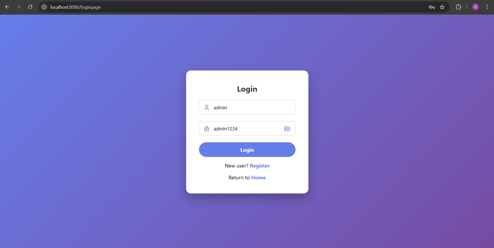
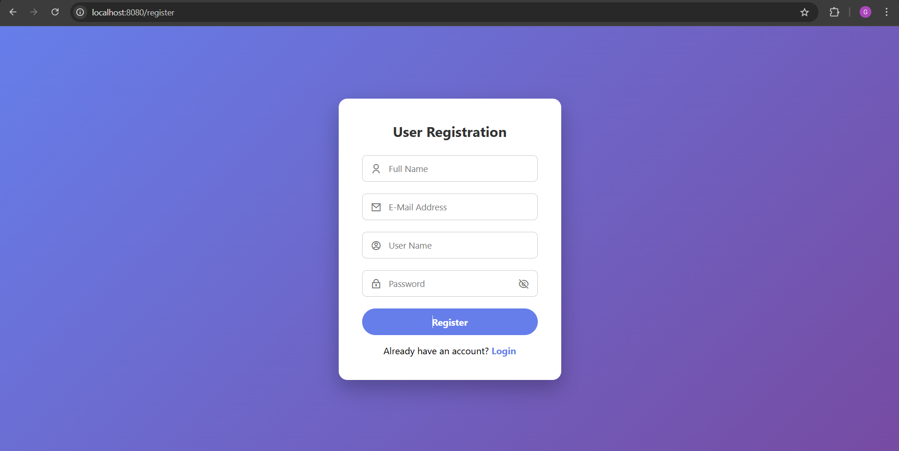
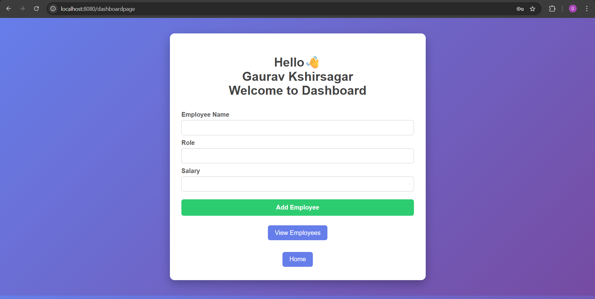
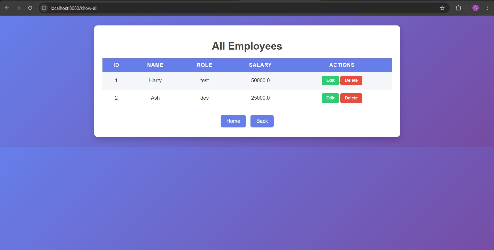

🚀 Employee Management System
Spring MVC | Spring Data JPA | MySQL | DAO Architecture | Java

📌 Project Overview
The Employee Management System is a web-based CRUD application developed using Spring MVC architecture.
This project demonstrates real-world backend development concepts including layered architecture, database integration, and secure user authentication.

The system allows users to:
Register & Login
Add Employees
View Employee List
Update Employee Details
Delete Employees
This project was built mainly for hands-on learning of Spring MVC, JPA, and DAO design pattern.

🛠️ Tech Stack

Java 17	            -  Back-end Development
Spring Boot 2.7.15  -  Application Framework
Spring MVC	        -  Web Architecture
Spring Data JPA     -  Database Operations
MySQL	              -  Database
JSP + JSTL          -  View Layer
Maven	              -  Dependency Management
Tomcat	            -  Embedded Server

🏗️ Architecture Used
This project follows Layered MVC Architecture:

Controller Layer  → Handles Requests
Service Layer     → Business Logic
DAO/Repository    → Database Access
Entity Layer      → Database Mapping
View (JSP)        → UI

🔐 Authentication Features
User Registration
Login Validation
Username uniqueness validation
Password verification using backend validation

📂 Project Features
✅ User Registration & Login
✅ Employee CRUD Operations
✅ Database Integration (MySQL)
✅ DAO Architecture Implementation
✅ Form Validation
✅ Clean UI using JSP & CSS

⚙️ Setup Instructions

1️⃣ Clone Repository
git clone https://github.com/YOUR_USERNAME/EmployeeManagementSystemSpringMVC.git

2️⃣ Configure Database
Create database in MySQL:
CREATE DATABASE employee_db;

Update application.properties:
spring.datasource.url=jdbc:mysql://localhost:3306/employee_db
spring.datasource.username=root
spring.datasource.password=your_password

3️⃣ Run Application

Using Maven:
mvn spring-boot:run
OR run main class from IDE.

4️⃣ Open in Browser
http://localhost:8080/loginpage
📸 Screenshots

### 🔐 Login Page

### 📝 Register Page

### 📊 Dashboard

### 👨‍💼 Employee List

🎯 Learning Outcomes
Understanding Spring MVC flow
DAO & Service layer separation
JPA Repository usage
Form handling with JSP
Database connectivity
Authentication logic implementation

⭐ Future Improvements
Spring Security integration
Role-based authentication (Admin/User)
REST API version
Deployment on cloud (Render/AWS)

📄 License
This project is created for learning and educational purposes.